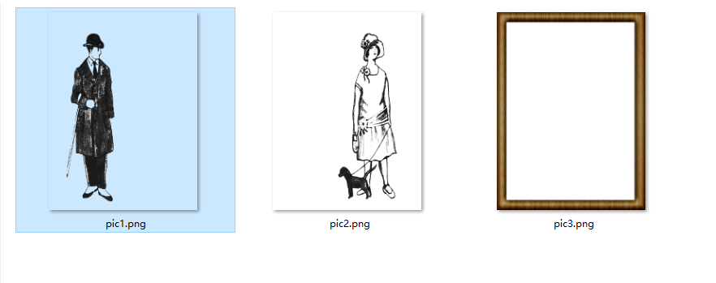
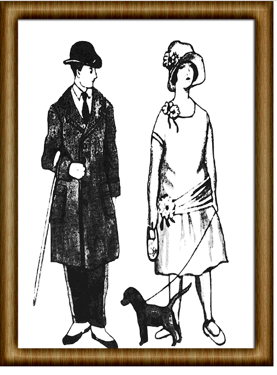

## canvas 合成多张图片

新接手的项目中碰到需要多张 png 图片合成一个图片显示的需求，原来的前端直接使用的 多个img标签叠加。效果不是很好，因此决定使用canvas 更改。

多张png图片如下：

最终效果



demo代码如下：
```javascript
const arr = ['./png/pic1.png', './png/pic2.png', './png/pic3.png']
function imgLoad(imgurl) {
  return new Promise((resolve, reject) => {
    const img = new Image()
    img.src = imgurl
    img.onload = function () {
      resolve(img)
    }
    img.onerror = function () {
      reject()
    }
  })
}

async function drawImage() {
  console.log(12)
  const canvas = document.createElement('canvas')
  canvas.width = 540
  canvas.height = 720
  const ctx = canvas.getContext('2d')
  for (var i = 0; i < arr.length; i++) {
    try {
      let img = await imgLoad(arr[i])
      ctx.drawImage(img, 0, 0, 540, 720)
    } catch (error) {

    }
  }
  console.log(canvas.toDataURL('image/png'))
  var img = document.createElement('img')
  img.src = canvas.toDataURL('image/png')
  document.body.append(img)
}

drawImage()
```
<Gitalk></Gitalk>


