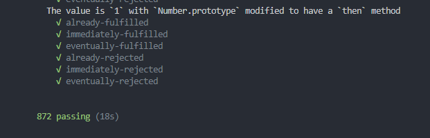

# 实现一个符合Promise/A+规范的Promise


Promise的出现有效的解决了js 代码出现回调地狱的问题。从而保证了代码的可读性和整洁性。

Promise的使用请参考阮一峰大佬的es6标准入门。[Promise 对象](http://es6.ruanyifeng.com/?search=promise&x=0&y=0#docs/promise)。Promise的规范参考[Promises/A+规范](http://www.ituring.com.cn/article/66566)

本篇主要来一步步实现一个符合Promise/A+规范的Promise。

## 第一个版本

```javascript
function MyPromise(executor) {

  var self = this
  self.status = 'pending'     // 当前状态
  self.value = undefined      //resolved状态时的值
  self.reason = undefined     //rejected状态时的原因

  function resolve(value) {
    if (self.status === 'pending') {
      self.status = 'resolved'
      self.value = value
    }
  }
  function reject(reason) {
    if (self.status === 'pending') {
      self.status = 'rejected'
      self.reason = reason
    }
  }
  try {
    executor(resolve, reject)
  } catch (error) {
    reject(error)
  }
}

MyPromise.prototype.then = function (onFullifilledFn, onRejectedFn) {
  let self = this;
  switch (self.status) {
    case 'resolved':
      onFullifilledFn(self.value)
      break;
    case 'rejected':
      onRejectedFn(self.reason)
      break;
    default:
      break;
  }
}

var p = new MyPromise((resolve, reject) => {
  resolve('hello')
})
p.then(res => {
  console.log(res)  //hello
})
```
此时已经可以实现一个在发生状态改变时，调用then方法中的对象状态的操作。

但是此时我们时无法处理异步的 resolve/reject 的。如下
```javascript
var p1 = new MyPromise((resolve, reject) => {
  setTimeout(() => {
    resolve('world')
  }, 0)
})

p1.then(res => {
  console.log(res, '异步调用')  //无输出
})
```

## 处理异步的 resolve/reject

为了处理异步 resolve/reject，需要修改myPromise的定义，**暂时先使用两个函数在保存异步的方法**。 
```javascript
function MyPromise(executor) {
  var self = this
  self.status = 'pending'     // 当前状态
  self.value = undefined      //resolved状态时的值
  self.reason = undefined     //rejected状态时的原因
  self.onFullifilledFn = value => value
  self.onRejectedFn = error => { throw error }
  function resolve(value) {
    if (self.status === 'pending') {
      self.status = 'resolved'
      self.value = value
      self.onFullifilledFn(self.value)
    }
  }
  function reject(reason) {
    if (self.status === 'pending') {
      self.status = 'rejected'
      self.reason = reason
      self.onRejectedFn(self.reason)
    }
  }
  try {
    executor(resolve, reject)
  } catch (error) {
    reject(error)
  }
}

MyPromise.prototype.then = function (onFullifilledFn, onRejectedFn) {
  let self = this;
  switch (self.status) {
    case 'pending':
      self.onFullifilledFn = onFullifilledFn
      self.onRejectedFn = onRejectedFn
      break;
    case 'resolved':
      onFullifilledFn(self.value)
      break;
    case 'rejected':
      onRejectedFn(self.reason)
      break;
    default:
      break;
  }
}

var p2 = new MyPromise((resolve, reject) => {
  setTimeout(() => {
    resolve(11)
  })
})
p2.then(res => {
  console.log(res)    //11
})
```


## then 方法规范
* 当 promise 成功执行时，所有 onFulfilled 需按照其注册顺序依次回调
* 当 promise 被拒绝执行时，所有的 onRejected 需按照其注册顺序依次回调
* then 方法必须返回一个 promise 对象 并且支持链式调用

因此上面的定义的 self.onFullifilledFn / self.onRejectedFn 不符合要求，**因为他们不能实现按照其注册顺序依次回调**。因此需要将 self.onFullifilledFn / self.onRejectedFn 改为数组。具体如下
```javascript
function MyPromise(executor) {
  var self = this
  self.status = 'pending'     // 当前状态
  self.value = undefined      //resolved状态时的值
  self.reason = undefined     //rejected状态时的原因
  self.onFullifilledCallbacks = []
  self.onRejectedCallbacks = []
  function resolve(value) {
    if (self.status === 'pending') {
      self.status = 'resolved'
      self.value = value
      self.onFullifilledCallbacks.forEach(cb => cb(self.value));
    }
  }
  function reject(reason) {
    if (self.status === 'pending') {
      self.status = 'rejected'
      self.reason = reason
      self.onRejectedCallbacks.forEach(cb => cb(self.reason))
    }
  }
  try {
    executor(resolve, reject)
  } catch (error) {
    reject(error)
  }
}

MyPromise.prototype.then = function (onFullifilledFn, onRejectedFn) {
  onFullifilledFn = typeof onFullifilledFn === 'function' ? onFullifilledFn : value => value
  onRejectedFn = typeof onRejectedFn === 'function' ? onRejectedFn : error => { throw error }
  let self = this;
  let promise2;
  switch (self.status) {
    case 'pending':
      promise2 = new MyPromise((resolve, reject) => {
        self.onFullifilledCallbacks.push(() => {
          try {
            let temp = onFullifilledFn(self.value)
            resolve(temp)
          } catch (error) {
            reject(error)
          }

        })
        self.onRejectedCallbacks.push(() => {
          try {
            let temp = onRejectedFn(self.reason)
            reject(temp)
          } catch (error) {
            reject(error)
          }
        })
      })
      break;
    case 'resolved':
      // onFullifilledFn(self.value)
      promise2 = new MyPromise((resolve, reject) => {
        try {
          let temp = onFullifilledFn(self.value)
          resolve(temp)
        } catch (error) {
          reject(error)
        }
      })

      break;
    case 'rejected':
      // onRejectedFn(self.reason)
      promise2 = new MyPromise((resolve, reject) => {
        try {
          let temp = onRejectedFn(self.reason)
          reject(temp)
        } catch (error) {
          reject(error)
        }
      })
      break;
    default:
      break;
  }
  return promise2
}

var p3 = new MyPromise((resolve, reject) => {
  setTimeout(() => {
    resolve(11)
  }, 1000)
})

p3.then(res => {
  console.log(res, '第一次then调用')   //11  第一次then调用
  return res * 2
}).then(res => {
  console.log(res, '第二次then调用')//22  第二次then调用
})
```
## then 函数中 onFullfilled/onRejected 返回值
上面的实现方式，我们来看一下下面的调用:
```javascript
var p4 = new MyPromise((resolve, reject) => {
  setTimeout(() => {
    resolve(11)
  })
})
p4.then(res => {
  console.log(res, '第一次then调用')    //11
  return new MyPromise((resolve, reject) => {
    setTimeout(() => {
      resolve(res * 2)
    }, 1000)
  })
}).then(res => {
  console.log(res, '第二次then调用')
})
```
输入结果如下，发现是又问题的。


先来看promise对于onFullfilled 的要求
1. 如果onFullfilled函数返回的是该promise本身，那么会抛出类型错误
2. 如果onFullfilled函数返回的是一个不同的promise，那么执行该promise的then函数，在then函数里将这个promise的状态转移给新的promise
3. 如果返回的是一个嵌套类型的promsie，那么需要递归。
4. 如果返回的是非promsie的对象或者函数，那么会选择直接将该对象或者函数，给新的promise。

根据要求，从新定义resolve函数，promise/A+中称这个函数为resolvePromise
```javascript
function resolvePromise(promise, x, resolve, reject) {
  if (promise === x) {  
    return reject(new TypeError("Cyclic reference"));
  }
  let isUsed;

  if (x !== null && (typeof x === "object" || typeof x === "function")) { 
    try {
      let then = x.then;
      if (typeof then === "function") {
        //
        then.call(x, function (v) {
          if (isUsed) return;
          isUsed = true;
          resolvePromise(promise, v, resolve, reject)
        }, function (e) {
          if (isUsed) return;
          isUsed = true;
          reject(e);
        })
      } else {
        resolve(x);
      }
    } catch (e) {
      if (isUsed) return;
      isUsed = true;
      reject(e);
    }
  } else {
    resolve(x);
  }
}
```
同时更改then函数

```javascript
MyPromise.prototype.then = function (onFullifilledFn, onRejectedFn) {
  onFullifilledFn = typeof onFullifilledFn === 'function' ? onFullifilledFn : function (x) { return x }
  onRejectedFn = typeof onRejectedFn === 'function' ? onRejectedFn : function (e) { throw e };
  let self = this;
  let promise2;
  switch (self.status) {
    case 'pending':
      promise2 = new MyPromise((resolve, reject) => {
        self.onFullifilledCallbacks.push(() => {
          setTimeout(() => {
            try {
              let temp = onFullifilledFn(self.value)
              resolvePromise(promise2, temp, resolve, reject)
            } catch (error) {
              reject(error)
            }
          });

        })
        self.onRejectedCallbacks.push(() => {
          setTimeout(() => {
            try {
              let temp = onRejectedFn(self.reason)
              resolvePromise(promise2, temp, resolve, reject)
            } catch (error) {
              reject(error)
            }
          });
        })
      })
      break;
    case 'resolved':
      // onFullifilledFn(self.value)
      promise2 = new MyPromise((resolve, reject) => {
        setTimeout(() => {
          try {
            let temp = onFullifilledFn(self.value)
            resolvePromise(promise2, temp, resolve, reject)
          } catch (error) {
            reject(error)
          }
        });
      })

      break;
    case 'rejected':
      // onRejectedFn(self.reason)
      promise2 = new MyPromise((resolve, reject) => {
        setTimeout(() => {
          try {
            let temp = onRejectedFn(self.reason)
            resolvePromise(promise2, temp, resolve, reject)
          } catch (error) {
            reject(error)
          }
        });
      })
      break;
    default:
      break;
  }
  return promise2
}
```
## 完整代码
```javascript
function MyPromise(executor) {
  var self = this
  self.status = 'pending'     // 当前状态
  self.value = undefined      //resolved状态时的值
  self.reason = undefined     //rejected状态时的原因
  self.onFullifilledCallbacks = []
  self.onRejectedCallbacks = []
  function resolve(value) {
    if (self.status === 'pending') {
      self.status = 'resolved'
      self.value = value
      self.onFullifilledCallbacks.forEach(cb => cb(self.value));
    }
  }
  function reject(reason) {
    if (self.status === 'pending') {
      self.status = 'rejected'
      self.reason = reason
      self.onRejectedCallbacks.forEach(cb => cb(self.reason))
    }
  }
  try {
    executor(resolve, reject)
  } catch (error) {
    reject(error)
  }
}

MyPromise.prototype.then = function (onFullifilledFn, onRejectedFn) {
  onFullifilledFn = typeof onFullifilledFn === 'function' ? onFullifilledFn : function (x) { return x }
  onRejectedFn = typeof onRejectedFn === 'function' ? onRejectedFn : function (e) { throw e };
  let self = this;
  let promise2;
  switch (self.status) {
    case 'pending':
      promise2 = new MyPromise((resolve, reject) => {
        self.onFullifilledCallbacks.push(() => {
          setTimeout(() => {
            try {
              let temp = onFullifilledFn(self.value)
              resolvePromise(promise2, temp, resolve, reject)
            } catch (error) {
              reject(error)
            }
          });

        })
        self.onRejectedCallbacks.push(() => {
          setTimeout(() => {
            try {
              let temp = onRejectedFn(self.reason)
              resolvePromise(promise2, temp, resolve, reject)
            } catch (error) {
              reject(error)
            }
          });
        })
      })
      break;
    case 'resolved':
      // onFullifilledFn(self.value)
      promise2 = new MyPromise((resolve, reject) => {
        setTimeout(() => {
          try {
            let temp = onFullifilledFn(self.value)
            resolvePromise(promise2, temp, resolve, reject)
          } catch (error) {
            reject(error)
          }
        });
      })

      break;
    case 'rejected':
      // onRejectedFn(self.reason)
      promise2 = new MyPromise((resolve, reject) => {
        setTimeout(() => {
          try {
            let temp = onRejectedFn(self.reason)
            resolvePromise(promise2, temp, resolve, reject)
          } catch (error) {
            reject(error)
          }
        });
      })
      break;
    default:
      break;
  }
  return promise2
}

function resolvePromise(promise, x, resolve, reject) {
  if (promise === x) {
    return reject(new TypeError("Cyclic reference"));
  }
  let isUsed;

  if (x !== null && (typeof x === "object" || typeof x === "function")) {
    try {
      let then = x.then;
      if (typeof then === "function") {
        //
        then.call(x, function (v) {
          if (isUsed) return;
          isUsed = true;
          resolvePromise(promise, v, resolve, reject)
        }, function (e) {
          if (isUsed) return;
          isUsed = true;
          reject(e);
        })
      } else {
        resolve(x);
      }
    } catch (e) {
      if (isUsed) return;
      isUsed = true;
      reject(e);
    }
  } else {
    resolve(x);
  }
}

MyPromise.deferred = function () {
  let dfd = {};
  dfd.promise = new MyPromise(function (resolve, reject) {
    dfd.resolve = resolve;
    dfd.reject = reject;
  });
  return dfd;
}
module.exports = MyPromise;
```
测试：
```javascript
npm install -g promises-aplus-tests 
promises-aplus-tests MyPromise.js
```


<Gitalk></Gitalk>


