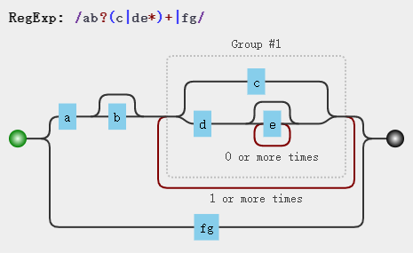
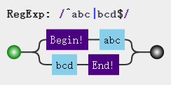
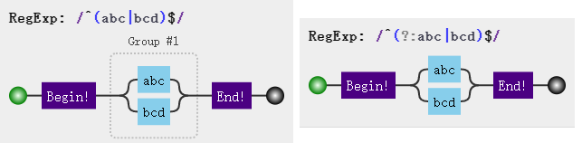

# 正则
***笔记整理来源于《JavaScript正则表达式迷你书》***    
> **正则表达式是匹配模式，要么匹配字符，要么匹配位置**  

[正则可视化验证网站](https://jex.im/regulex/#!flags=&re=%5E(a%7Cb)*%3F%24)
或者 [正则可视化验证网站1](https://regexper.com/)
修饰符字符 | 含义
----------|---------
i         | 不区分大小写
g         |执行全局匹配，即找到所有的匹配，而不是找到第一个之后就停止
m         |多行匹配模式，^匹配一行的开头和字符串的开头，$匹配行的结束和字符串的结束


## 1、正则表达式匹配攻略
### 1.1 模糊匹配
* 横向模糊匹配   
  实现方式使用量词。如 `{m,n}`,表示至少出现 m 次，最多出现 n 次     
  ```js
  var reg = /ab{2,5}c/g
  'abc abbc abbbc abbbbc abbbbbc'.match(reg) // ["abbc", "abbbc", "abbbbc", "abbbbbc"]
  ```
* 纵向模糊匹配    
  实现方式使用数组，如 `[abc]` 表示匹配中间任意一个
  ```js
  var reg = /a[123]b/g
  var str = 'aob a1b a2b a3b a4b'
  str.match(reg) // ["a1b", "a2b", "a3b"]
  ```
### 1.2 字符组
用一组单词来表示需要被匹配到的一个字符。
* 范围表示法 `[a-z]` 表示所有小写字母,`[0-9]` 表示所有数字等
* 排除字符组 `[^a]` 处理 `a` 之外所有,`[^abc]` 除了`a,b,c`外所有。
常见
* 常见的简写字符组  

字符组   |  具体含义
--------|-----------
\d      | 代表 `[0-9]`， 记忆方式 digit(数字)
\D      | 代表 `[^0-9]`，与 `\d` 对比记忆
\w      | 代表 `[0-9a-zA-Z_]` 数字字母下划线。记忆方式 word 单词字符
\W      | 代表 `[^0-9a-zA-Z_]` 与 \w 对比记忆
\s      | 代表 `[ \t\v\n\r\f]`。所有空白符（空格、水平制表符、垂直制表符、换行符、回车符、换页符）。记忆方式 space
\S      | 代表 `[^ \t\v\n\r\f]`。非空字符 \s 对比记忆
.       | 代表 `[^\n\s\u2028\u2029]`.通配符，几乎任意字符。换行符、回车符、行分隔符和段分隔符除外

如果要匹配任意字符:`[\d\D]、[\s\S]、[\w\W]、[^]`

### 1.3、量词
量词    | 含义
--------|---------------
{m,}    | 至少出现 m 次
{m,n}   | 至少出现 m 次，最多出现 n 次
?       | 相当于 {0,1} 没有或者一次
+       | 相当于{1,} ，至少一次
*       | 相当于{0,},不出现或者出现任意次数，

### 1.4 贪婪匹配和惰性匹配
* 贪婪匹配
  ```js
  var reg = /\d{2,5}/g
  var str = '123 1234 12345'
  str.match(reg) // ["123", "1234", "12345"]
  ```
  正则默认的是贪婪匹配，它会可能的去匹配符合自身的较多的范围。
* 惰性匹配
  ```js
  var reg = /\d{2,5}?/g
  var str = '123 1234 12345'
  str.match(reg)  // ["12", "12", "34", "12", "34"]
  ```
  在量词之后加上 `?` 就可以将正则改为惰性匹配
### 1.5 多选分支
多选分支就是支持多个子模式任选其一。通过管道符实现。如 `(p1|p1|p3)` 匹配 `p1、p2、p3`中间任意一个。
```JS
var reg = /good|goodbye/g
var str = 'goodbye'
str.match(reg) // ["good"]

var reg1 = /goodbye|good/g
var str1 = 'goodbye'
str1.match(reg1) // ["goodbye"]
```
由上可知，多选分支默认为惰性匹配。

### 案例
1. 匹配 16进制颜色值
  ```js
  var reg = /#([0-9a-fA-F]{6}|[0-9a-fA-F]{3})/g
  var str = '#ffbbdb #Fc01DF #FFF #ffe'
  str.match(reg) //  ["#ffbbdb", "#Fc01DF", "#FFF", "#ffe"]
  ```
2. 匹配时间
  ```js
  var reg = /^([01][0-9]|2[0-3]):[0-5][0-9]$/
  reg.test('23:59') // true
  reg.test('08:08') // true
  ```
3. 匹配日期
  ```js
  var reg = /^[0-9]{4}-(0[1-9]|1[0-2])-(0[1-9]|[12][0-9]|3[01])$/g
  reg.test('2018-08-08') // true
  ```
3. 匹配 window 操作系统文件路径
  ```js
  var reg = /^[a-zA-Z]:\\([^\\:*<>|"?\r\n]+\\)*([^\\:*<>|"?\r\n]+)?$/
  reg.test('F:\\study\\javascript\\reg\\index.md') // true
  reg.test('F:\\study\\javascript\\reg\\') // true
  ```
4. 匹配 id
  ```js
  var reg = /id=".*"/g  // 贪婪匹配，会匹配到 id 后面的引号时不会停止
  var str = '<div id="conteniner" class="main"></div>'
  str.match(reg) // ["id="conteniner" class="main""]
  // 改为 惰性匹配既可以解决 但是又会引起正则回溯问题 具体看下面
  var reg1 = /id=".*?"/g
  var reg2 = /id="[^"]*"/g
  str.match(reg2) // ["id="conteniner""]
  ```


## 2、正则表达式位置匹配攻略
es5中，共有6个位置的锚：
锚     | 含义
-------|-------
^      | 匹配开头
$      | 匹配结尾
\b     | 单词的边界
\B     | 非单词的边界
(?=p)  | 匹配的位置之后要有 p   (正向先行断言)
(?!p)   | 匹配的位置之后不能有 p (负向先行断言)
(?<=y)x | x 前面有 y 的时候才匹配 x (后行断言)
(?<!y)x | x 前面不能有 y 的时候才匹配 x (后行否定断言)

### 2.1 \b 和 \B
```js
var str = '[js]lesson_o1.mp3'
str.replace(/\b/g,'#')  //"[#js#]#lesson_o1#.#mp3#"
str.replace(/\B/g,'#')  //"#[j#s]l#e#s#s#o#n#_#o#1.m#p#3"
```

### 2.2 (?=p) 和 (?!p)
```js
'hello'.replace(/(?=l)/g,'#') // "he#l#lo"
'hello'.replace(/(?!l)/g,'#') // "#h#ell#o#"
```
### 2.3 (?<=y)x 和 (?<!y)x 

```js
var str = 'abcyxerx'
str.replace(/(?<=y)x/g,'#') //"abcy#erx"
str.replace(/(?<!y)x/g,'#') // "abcyxer#"
```
### 2.4 案例
1. ***数字的千分位匹配*** 经典的使用正向先行断言案例:
```js
var str = '12345678'
str.replace(/(?=\d{3}$)/,',') // "12345,678"
// 此时只能匹配到最后面的三位 
// 前面也要哭 三个字符一组 因此对于 \d{3} 增减量词
str.replace(/(?=(\d{3})+$)/g,',') // "12,345,678"
// 但是此时出现一个问题，数字的长度位 3 的倍数时，开头的第一位被匹配掉
'123456789'.replace(/(?=(\d{3})+$)/g,',') // ",123,456,789"

// 因此需要继续优化，要求匹配到的位置不能为开头 (?!^) 先行否定断言(负向先行断言)
str.replace(/(?!^)(?=(\d{3})+$)/g,',')
```
2. 格式化
根据上面的例子将货币格式话:
```js
function format(num){
  return num.toFixed(2).replace(/\B(?=(\d{3})+\b)/g,",").replace(/^/,'$$')
}
format(1888) // $1,888.00
```
3. 密码问题 必须含有数字和字符
* 必须包含数字
```js
var reg = /(?=.*[0-9])/  // 匹配的任意字符前面需要有数字
```
* 必须包含字符
```js
var reg = /(?=.*[a-zA-Z])/   // 匹配的任意字符前面需要有字母
```
整合之后
```js
var reg = /(?=.*[0-9])(?=.*[a-zA-Z])^[0-9a-zA-Z]{6,12}$/
```
**另一种解法**
```js
var reg = /(?!^[0-9]{6,12}$)(?!^[a-z]{6,12}$)(?!^[A-Z]{6,12}$)^[0-9A-Za-z]{6,12}$/
```


## 3、正则表达式中括号的作用

1. 分组和分支结构
  ```js
  var reg = /(ab)+/
  'ababa abbb ababab'.match(/(ab)+/g) // ["abab", "ab", "ababab"]
  var reg = /(a|b)/g
  ```
2. 分组引用     
  **用来提取数据:** `match` 函数接受的正则没有修饰符 `g` 的时候返回值如下。从第二位看时返回的是每个组中的具体值
  ```js
  var regex = /(\d{4})-(\d{2})-(\d{2})/;
  '2018-08-08'.match(regex)  // ["2018-08-08", "2018", "08", "08", index: 0, input: "2018-08-08", groups: undefined]
  regex.test('2018-08-08')
  console.log(RegExp.$1,RegExp.$2,RegExp.$3) // 2018,08,08
  ```
3. 反向引用
  ```js
  var regex = /\d{4}(-|\/|\.)\d{2}(-|\/|\.)\d{2}/;
  var string1 = "2017-06-12";
  var string2 = "2017/06/12";
  var string3 = "2017.06.12";
  var string4 = "2016-06/12";
  console.log( regex.test(string1) ); // true
  console.log( regex.test(string2) ); // true
  console.log( regex.test(string3) ); // true
  console.log( regex.test(string4) ); // true  此种情况也被匹配到 
  ``` 
  假设我们想要求分割符前后一致，就需要使用反向引用：
  ```js
  var regex = /\d{4}(-|\/|\.)\d{2}\1\d{2}/;
  var string1 = "2017-06-12";
  var string2 = "2017/06/12";
  var string3 = "2017.06.12";
  var string4 = "2016-06/12";
  console.log( regex.test(string1) ); // true
  console.log( regex.test(string2) ); // true
  console.log( regex.test(string3) ); // true
  console.log( regex.test(string4) ); // false
  ```
  如上`\1` 就代表第一个组。同理可以使用`\2、\3` `\10`表示第10个括号。如果要匹配`\1和0`则使用`(?:\1)0`或者`\1(?:0)`。**`(?:)` 是非捕获分组，当你需要进行分组，但不需要捕获的时候使用，有助于提高性能。**        
  **反向引用了不存在的分组的话，会作为普通的字符来进行匹配。**          
  **分组后面有量词，分组后面有量词的话，分组最终捕获到的数据是最后一次的匹配**如下：
  ```js
  var regex = /(\d)+ \1/;
  console.log( regex.test("12345 1") ); // false
  console.log( regex.test("12345 5") ); // true
  ```

4. 非捕获组
  括号会自动的捕获匹配到的数据，以便后续的使用，但是如果只是想要括号最原始的功能，匹配到的值在之后并不会使用到，可以使用非捕获括号来进行处理。`(?:p)`,`(?:p1|p2|p3)`


#### 总结案例
1. trim 的模拟
```js
function trim(str) {
  return str.replace(/^\s+|\s+$/g, '');
}
function trim (str) {
  return str.replace(/^\s*(.*?)\s*$/g, "$1");
}
```
2. 将每个单词的首字母
```js
function titleize (str) {
  return str.toLowerCase().replace(/(?:^|\s)\w/g, function (c) {
    return c.toUpperCase();
  });
}
```
3. 驼峰化
```js
function camelize (str) {
  return str.replace(/[-_\s]+(.)?/g, function (match, c) {
    return c ? c.toUpperCase() : '';
  })
}
```
4. 中划线化
```js
function dasherize (str) {
  return str.replace(/([A-Z])/g, '-$1').replace(/[-_\s]+/g, '-').toLowerCase();
}
```
5. HTML 转义和反转义
```js
function escapeHTML (str) {
  var escapeChars = {
  '<' : 'lt',
  '>' : 'gt',
  '"' : 'quot',
  '&' : 'amp',
  '\'' : '#39'
  };
  return str.replace(new RegExp('[' + Object.keys(escapeChars).join('') +']', 'g'), function (match) {
      return '&' + escapeChars[match] + ';';
  });
}
escapeHTML('<div>你好世界</div>') // "&lt;div&gt;你好世界&lt;/div&gt;"
```
```js
// 实体字符转换为等值的HTML。
function unescapeHTML (str) {
  var htmlEntities = {
  nbsp: ' ',
  lt: '<',
  gt: '>',
  quot: '"',
  amp: '&',
  apos: '\''
  };
  return str.replace(/\&([^;]+);/g, function (match, key) {
    if (key in htmlEntities) {
      return htmlEntities[key];
    }
    return match;
  });
}
unescapeHTML("&lt;div&gt;你好世界&lt;/div&gt;") // "<div>你好世界</div>"
```
## 4、正则表达式的回溯法原理

[回溯法原理](https://juejin.im/post/5965943ff265da6c30653879#heading-21)


## 5、正则表达式的拆分

操作符描述      | 操作符                            | 优先级
---------------|-----------------------------------|-------------------------
转义符         | \                                 |1
括号和方括号    |(…)、(?:…)、(?=…)、(?!…)、[…]      | 2
量词限定符      |{m}、{m,n}、{m,}、?、*、+          |3  
位置和序列      |^、$、\元字符、一般字符             |4
管道符（竖杠）  |     \|                            |5

**上面操作符的优先级从上至下，由高到低。**

**具体案例分析：**
```js
var reg = /ab?(c|de*)+|fg/
// 因为 （） 存在，因此(c|de*)是一个整体。又 * 量词存在因此 de*为一个整体。
```


```js
var reg = /^abc|bcd$/
// 因为 ^ 和 $ 的优先级高于 | 因此会出现下面的情况
```
      
因此加上括号进行处理，具体如下:
```js
var reg = /^(abc|bcd)$/
var reg1 = /^(?:abc|bcd)$/  // 和上面对比 不要保存组
```
                  
量词连缀问题：
```js
var reg =  /^[abc]{3}+/ // 此时报错 需要修改成如下所示:
var reg1 =  /^([abc]{3})+/ 
```
![/^([abc]{3})+/](./reg4.png)                

#### 5.1 、元字符转义问题
所有结构中，用到的元字符总结如下：
```
^、$、.、*、+、?、|、\、/、(、)、[、]、{、}、=、!、:、- ,
```
当匹配上面的字符本身时，可以一律转义：
```js
var string = "^$.*+?|\\/[]{}=!:-,";
var regex = /\^\$\.\*\+\?\|\\\/\[\]\{\}\=\!\:\-\,/;
console.log( regex.test(string) );
```
```js
var string = "^$.*+?|\\/[]{}=!:-,";
var string2 = "\^\$\.\*\+\?\|\\\/\[\]\{\}\=\!\:\-\,";
console.log( string == string2 );
```
**字符组中的元字符:**
跟字符组相关的元字符有 `[、]、^、-`。因此在会引起歧义的地方进行转义。例如开头的 ^ 必须转义，不然
会把整个字符组，看成反义字符组。
```js
var string = "^$.*+?|\\/[]{}=!:-,";
var regex = /[\^$.*+?|\\/\[\]{}=!:\-,]/g;
console.log( string.match(regex) );// => ["^", "$", ".", "*", "+", "?", "|", "\", "/", "[", "]", "{", "}", "=", "!", ":","-", ","]
```

**对于 `[abc]` 和 `{3,5}`**
```js
var string = "[abc]";
var regex = /\[abc]/g;
console.log( string.match(regex)[0] );  // 同理，要匹配字符串 "{3,5}"，只需要把正则写成 /\{3,5}/ 即可。但是，括号需要前后都转义的，如 /\(123\)/。
```

/^(?:(?:25[0-5]|2[0-4][0-9]|[01]?[0-9][0-9]?)\.){3}(?:25[0-5]|2[0-4][0-9]|[01]?[0-9][0-9]?)$/