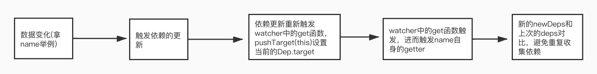

# vue中渲染函数观察者

对于组件中`render`函数的`watcher`的实例化是在`beforeMount`之后。

```js
//core/instance/lifecycle.js
updateComponent = () => {
  vm._update(vm._render(), hydrating)
}
new Watcher(vm, updateComponent, noop, {
  before () {
    if (vm._isMounted && !vm._isDestroyed) {
      callHook(vm, 'beforeUpdate')
    }
  }
}, true /* isRenderWatcher */)
```
`vm._render`的执行用来生成`vnode`。`vm._update`的执行会将`vnode`生成真实的`dom`。这里先不做深究怎么实现。

## 依赖的收集
```html
<div id="demo">
  <p>{{name}}</p>
</div>
```
上面的模版通过`Vue.complie`编译之后生成如下的`render`函数。即此时的`vm.render`如下：
```js
function anonymous() {
  with(this) {
    return _c('div', {
        attrs: {
          "id": "demo"
        }
      },
      [_c('p', [_v(_s(name))])])
  }
}
```
当`updateComponent`函数的执行的时候会间接的触发`vm._render`的执行。而`vm.render`的执行会触发`name`的 `get` 操作。在此时数据已经被处理为了响应式的，即`name`的`getter/setter`已经被处理。因此获取`name`时触发自身的依赖收集。将此时的`watcher`收集到自身的`dep`中。

### dep收集watcher的路线
`dep`来进行收集当前的`watcher`路线可能有点绕。
```js
get: function reactiveGetter () {
  const value = getter ? getter.call(obj) : val
  if (Dep.target) {
    dep.depend()
    if (childOb) {
      childOb.dep.depend()
      if (Array.isArray(value)) {
        dependArray(value)
      }
    }
  }
  return value
}
```
此时的`Dep.target`就是渲染函数的`watcher`实例。因此进入`if`判断。执行`dep.depend()`。
```js
class Dep{
  depend () {
    if (Dep.target) {
      Dep.target.addDep(this)
    }
  }
}
```
```js
class Watcher{
  //....
  addDep (dep: Dep) {
    const id = dep.id
    if (!this.newDepIds.has(id)) {
      this.newDepIds.add(id)
      this.newDeps.push(dep)
      if (!this.depIds.has(id)) {
        dep.addSub(this)
      }
    }
  }
}
```
绕来绕去。最终在`Watcher`进行收集的操作。此时的`dep`依然是`name`自身的`getter/setter`形成闭包封装起来的`dep`。这么做的目的是，在`watcher`中进行了过滤的操作，避免重复收集同一个依赖。同时可以做到。`dep`中收集需要通知的`watcher`。同时`watcher`中收集到都会被谁所通知(储存在`watcher`自身的`deps`中)。

### 依赖收集过程中的过滤
修改上面的`html`模版如下:
```html
<div id="demo">
  <p>{{name}}{{name}}</p>
</div>
```
生成的渲染函数如下。此时需要触发两次`name`的`get`操作。
```js
function anonymous() {
  with(this) {
    return _c('div', {
        attrs: {
          "id": "demo"
        }
      },
      [_c('p', [_v(_s(name) + _s(name))])])
  }
}
```
**按照依赖收集的路线**。同一个属性只会在自己的`getter/setter`的闭包中生成一个`dep`，也就是说每一个属性的`dep.id`都是唯一的。因此对于第二次的获取`name`时避免掉了重复收集，此时就完成了同一次数据多次获取时候的依赖收集过滤。

同时`watcher`中使用`deps、depIds`永远保存着上次数据的`deps`。当`name`的数据变化时触发重新获取的操作时，会拿最新一次数据的`newDepIds、newDeps`与上一次的`deps`来进行对比。不需要的就删除，需要得就继续添加。所以对于`if (!this.depIds.has(id)) { dep.addSub(this) }`的作用其实就是，数据变化多次求值的时候避免调重复收集依赖。

路线图如下：

```js
class Watcher{
  //...
  addDep (dep: Dep) {
    const id = dep.id
    if (!this.newDepIds.has(id)) {
      this.newDepIds.add(id)
      this.newDeps.push(dep)
      if (!this.depIds.has(id)) {
        dep.addSub(this)
      }
    }
  }
  get () {
    pushTarget(this)
    let value
    const vm = this.vm
    try {
      value = this.getter.call(vm, vm)
    } catch (e) {
      // 省略...
    } finally {
      // 省略...
      popTarget()
      this.cleanupDeps()
    }
    return value
  }
  cleanupDeps () {
    let i = this.deps.length
    while (i--) {
      const dep = this.deps[i]
      if (!this.newDepIds.has(dep.id)) {
        dep.removeSub(this)
      }
    }
    let tmp = this.depIds
    this.depIds = this.newDepIds
    this.newDepIds = tmp
    this.newDepIds.clear()
    tmp = this.deps
    this.deps = this.newDeps
    this.newDeps = tmp
    this.newDeps.length = 0
  }
}
```

## 触发依赖的过程
加入模版如下；
```html
<div id="demo">
  <p>{{name}}今年{{age}}</p>
</div>
<script>
var app = new Vue({
  el: '#demo',
  data: {
    name: 'xiaopingbuxiao',
    age: 18
  },
  methods: {
    dataChange() {
      this.name = 'xiaoping'
      this.age = 19
    }
  },
})
</script>
```
则通过`Vue`编译之后生产的`render`函数如下:
```js
function anonymous() {
  with(this) {
    return _c('div', {
      attrs: {
        "id": "demo"
      }
    }, [_c('p', [_v(_s(name) + "今年" + _s(age))])])
  }
}
```
此时在`name`和`age`自身的`getter/setter`闭包中的`dep`中都收集到了`render`函数生成的`watcher`。所以当`name、age`变化的时候会通知`watcher`进行重新渲染。

像上面的例子中，调用`dataChange`函数同时改变了`name、age`。如果分别通知两次数据变化，`watcher`都去执行更新然后重新渲染的话显然是比较耗费性能的。因此`Vue`是不会这么做的，而是通过**异步更新**的策略来进行处理

### 异步更新
通过上面知道`name、age`的`deps`中都会收集到渲染函数的`watcher`实例。因此`name、age`变化时，触发更新。
```js
class Watcher{
  //...
  update () {
    if (this.lazy) {  
      this.dirty = true
    } else if (this.sync) {
      console.log(this.cb,'同步形式')
      this.run()
    } else {
      console.log(this.cb,'队列形式')
      queueWatcher(this)
    }
  }
}
```
对于渲染函数的`watcher`实例`this.lazy`为`false`(其实只会在`computed`中属性中为`true`)。同时`this.sync`也为`false`(同步更新的时候为`true`)。因此对于渲染函数的`watcher`执行了`queueWatcher(this)`。如下是`queueWatcher`的实现
```js
//core/observer/scheduler.js
let has = {}
let waiting = false
let flushing = false
let index = 0

export function queueWatcher (watcher: Watcher) {
  const id = watcher.id
  if (has[id] == null) {
    has[id] = true
    if (!flushing) {
      queue.push(watcher)
    } else {
      // if already flushing, splice the watcher based on its id
      // if already past its id, it will be run next immediately.
      let i = queue.length - 1
      while (i > index && queue[i].id > watcher.id) {
        i--
      }
      queue.splice(i + 1, 0, watcher)
    }
    // queue the flush
    if (!waiting) {
      waiting = true
      if (process.env.NODE_ENV !== 'production' && !config.async) {
        flushSchedulerQueue()
        return
      }
      nextTick(flushSchedulerQueue)
    }
  }
}
```
继续拿上面的例子。当`name、age`变化的时候，因此他们自身需要通知的`watcher`是同一个，通过`has`对象，避免渲染函数`watcher`实例多次的入队。同时定义了`flushing`一开始为`false`代表当前还没有开始队列的更新。此时如果有新的`watcher`入队直接放在队列尾部。如果已经开始队列的更新之后，又有新的`watcher`入队。则应该保证观察者`watcher`的执行顺序。

**按照我的理解，所有的触发`watcher`入队的操作都是在宏任务中收集，但是队列的更新是在`nextTick`的微任务中触发，所以此处没有想到什么场景下会出现`flushing===true`之后又进行了入队的操作。这里如果有了解的大佬请给我留言，不胜感激，谢谢谢谢🙏**。

**同步更新**

对于上面我们知道对于渲染函数的处理，是采用的异步更新策略,同样对于用户的`watch`默认也是放入队列异步更新的。但是其实我们自己的`watch`是可以这么玩的：
```js
watch:{
  name:{
    handler(){
      console.log('name发生变化')
    },
    sync:true
  }
}
```
强制指定`watch`采用同步更新。只是可以这么玩，迄今为止并没有碰到使用场景，同样强烈不推荐这么玩

暂时先不去关心`nextTick`的实现，把它当做事一个`setTimeout`理解。继续看`flushSchedulerQueue`，不需要关注的已经删除了，只看下面一部分。

```js
function flushSchedulerQueue () {
  currentFlushTimestamp = getNow()
  flushing = true
  let watcher, id
  
  queue.sort((a, b) => a.id - b.id)
  for (index = 0; index < queue.length; index++) {
    watcher = queue[index]
    if (watcher.before) { // beforeUpdate就是这里
      watcher.before()
    }
    id = watcher.id
    has[id] = null
    watcher.run()
  }
}
```
其中 `queue`的排序是为了：
1. Vue中的组件的创建与更新有点类似于事件捕获，都是从最外层向内层延伸，所以要先调用父组件的创建与更新
2. userWatcher比renderWatcher创建要早，这件的 renderWatch 永远在最后
3. 如果父组件的watcher调用run时将父组件干掉了，那其子组件的watcher也就没必要调用了

同时通过上面我们可以知道`watch`还可以这么玩。

```js
watch:{
  name:{
    handler(){
      console.log('name发生变化')
    },
    before(){
      console.log('name发生改变之前触发')
    },
  }
}
// 输出
//name发生改变之前触发
//name发生变化
```
此篇文章更多的倾向于自己的笔记，如果您有需要建议对照`vue`源码中`beforeMount`钩子之后`render`函数实例化`watcher`处开始。

<Gitalk></Gitalk>


